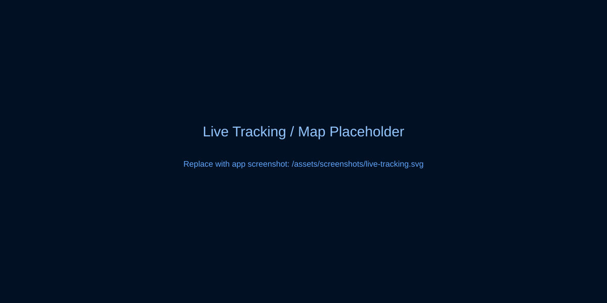
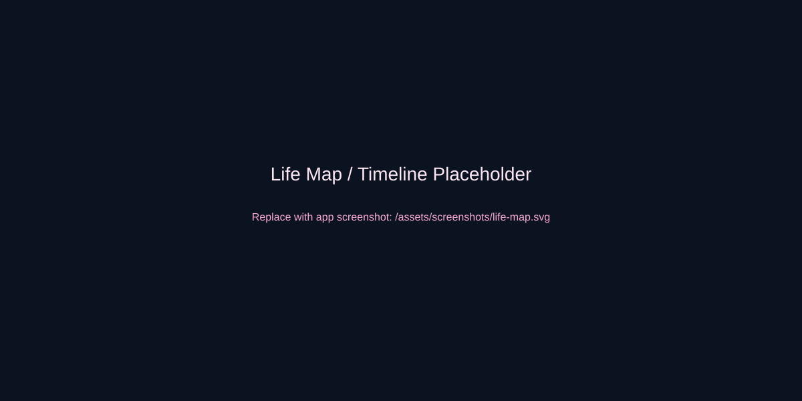

# **AeroTrace — Map Your Life, Not Your Flight**

> Capture journeys, relive memories, and build a living Life Map.

> Repository restructured: frontend code is in the `frontend/` folder and backend placeholder is `backend/`.

Run frontend commands from the `frontend` directory, e.g.:

```
cd frontend
npx tsc --noEmit
npm install
npm run build
```

[](https://github.com/your-org/aerotrace/releases)
[](LICENSE)
[](#)
[](#contributing)
[](#roadmap)

## **Overview**

AeroTrace is a GPS-powered journey tracking and memory platform that helps people create a visual archive of where they’ve been, what they did, and how their personal map evolves. Combining timeline exploration, route analytics, memory capture (photos + notes), and discovery features, AeroTrace is built to be polished, privacy-first, and product-ready for mobile and desktop web.

- Product focus: personal journey logging, memory storytelling, and location-centric discovery.
- Not an aviation dashboard — it's about personal journeys and memories.

## **Why AeroTrace**

AeroTrace exists because the way we capture location data today is fragmented:
- Maps show routes but lack personal context.
- Photos hold memories but lose location timelines.
- Fitness trackers show routes but not the story.

AeroTrace unifies route tracking, memory capture, and timeline storytelling so users can revisit life moments, analyze journeys, and discover places in one elegant web app.

## **Features**

- ✨ Modern UI and privacy-first local persistence
- 🧭 Live GPS journey tracking (real-time location & route rendering)
- 🗺️ Interactive Life Map with all historical journeys
- 📈 Journey statistics: distance, duration, elevation (where available)
- 📝 Memory capture: photos, notes, geotagged moments
- 🔎 Discovery system: visited places, nearby points of interest
- 🕰️ Timeline-based exploration to relive journeys by day
- 🎥 Real-time route visualization while recording
- ⚡ Offline-first with local storage and graceful sync plans
- 🔁 Export/import journeys (JSON/GPX) for portability

## **Screenshots**

> Replace placeholders with real captures in `./assets/screenshots/`

- Hero / Dashboard  
  

- Live Tracking / Map  
  

- Journey Summary  
  

- Life Map / Timeline  
  

## **Architecture Overview**

AeroTrace is a client-first React web app that separates UI concerns, local persistence, and future backend services.

- Client: React + TypeScript + Vite
- State: Context API for auth, navigation, journeys, and memory
- Storage: LocalStorage (current) with a sync-ready service layer
- Maps: Interactive map components (Mapbox/Leaflet-ready)
- Services: modular services for journey capture, storage, and import/export

```mermaid
flowchart LR
  A[Browser / User] --> B[React UI]
  B --> C[Context API]
  C --> D[Journey Service]
  C --> E[Memory Service]
  D --> F[Local Storage]
  E --> F
  D --> G[Map Renderer]
  G --> H[Map Provider (Mapbox/Leaflet)]
  subgraph Future
    D --> I[Backend API]
    E --> I
    I --> J[Cloud Sync / Auth / Storage]
    I --> K[AI Journey Stories]
  end
```

## **Tech Stack**

- Frontend: React, TypeScript, Vite
- UI: Tailwind CSS, Headless UI (optional)
- State: Context API
- Maps: Mapbox GL / Leaflet compatible components
- Build: Vite
- Storage: LocalStorage (planned: IndexedDB + Cloud sync)
- Testing: Jest / Vitest (suggested)
- Deployment: Vercel / Netlify / Static host

## **Installation**

Development (Windows/macOS/Linux)

1. Clone the repo
```bash
git clone https://github.com/your-org/aerotrace.git
cd aerotrace
```

2. Install dependencies
```bash
npm install
# or
pnpm install
```

3. Run development server
```bash
npm run dev
```

4. Build for production
```bash
npm run build
npm run preview
```

Environment notes:
- This project is client-first. Backend integration is planned and will use an env file like `.env` for API endpoints and keys.
- Map provider keys (Mapbox) are optional for dev; the app will run with a dev map provider stub.

## **Project Structure**

Top-level:
- [index.html](index.html)
- [package.json](package.json)
- [vite.config.ts](vite.config.ts)
- [tsconfig.json](tsconfig.json)
- [tailwind.config.cjs](tailwind.config.cjs)

Key source files:
- [src/main.tsx](src/main.tsx) — app bootstrap
- [src/App.tsx](src/App.tsx) — root app
- [src/index.css](src/index.css) — Tailwind entry
- [src/components](src/components) — UI + map components
- [src/context](src/context) — `AuthContext`, `JourneyContext`, `MemoryContext`
- [src/pages](src/pages) — route views (Dashboard, LiveJourney, LifeMap, Memories)
- [src/services](src/services) — `journeyStorage`, `buildLifeMapNodes`, import/export helpers

Example: Dashboard is in [src/pages/DashboardPage.tsx](src/pages/DashboardPage.tsx).

## **Roadmap**

**Completed**
- Live GPS journey tracking
- Real-time route visualization
- Journey Summary page
- Life Map visualization
- Memory capture (photos + notes)
- Local storage persistence
- Interactive maps and timeline navigation

**Near-term (next release)**
- Data export/import (GPX/JSON)
- Improved journey statistics (elevation, pace)
- Better mobile layout & PWA support
- Simple unit + integration tests

**Planned (Q3–Q4)**
- Backend integration: secure API for sync and storage
- User accounts & authentication
- Cloud sync and multi-device continuity
- AI-generated journey stories & photo-based memory summaries
- Community sharing, curated discovery feeds

## **Future Vision**

AeroTrace aims to be the personal Life Map layer of the internet:
- Seamless multi-device sync with privacy-first controls.
- AI-generated journey narratives and highlight reels.
- A lightweight social layer for sharing journey highlights and local discoveries (opt-in).
- Partnerships with mapping providers and photo services to enrich memory context.
- Monetization via a premium tier: multi-device sync, private cloud backups, advanced analytics, and AI story exports.

## **Contributing**

We welcome contributors — especially engineers, UX designers, and mapping/data enthusiasts.

How to contribute:
1. Fork the repo and create a feature branch: `git checkout -b feat/your-feature`
2. Open a pull request with a clear description and screenshots.
3. Run tests and ensure the build passes.
4. Follow code style: TypeScript types, sensible components, and Tailwind utility classes.

Please open issues for bugs, feature requests, or design ideas. See contributing guidelines for more.

## **For Recruiters & Founders**

AeroTrace demonstrates:
- Strong TypeScript + React architecture skills
- Product-minded UI/UX using Tailwind
- Experience with maps, real-time updates, and data persistence
- A roadmap targeting monetizable features (sync, AI stories, community)

If you're a founder or recruiter interested in collaboration or hiring the author, open an issue or reach out via the project profile.

## **License**

MIT — see [LICENSE](LICENSE).

## **Contact**

Project: AeroTrace  
Repo: https://github.com/your-org/aerotrace  
Author / Maintainer: Add your contact details or link to LinkedIn/GitHub profile here.

---

Want this polished further? I can:
- Replace placeholder screenshots with optimized images
- Add a live demo link and deploy config
- Generate example API spec for backend sync

Which would you like me to do next?
# AeroTrace

Aviation tracking dashboard built with React, TypeScript, Vite, and Tailwind CSS.

## Setup

```bash
npm install
npm run dev
```

## Scripts

- `npm run dev` — start development server
- `npm run build` — production build
- `npm run preview` — preview production build
